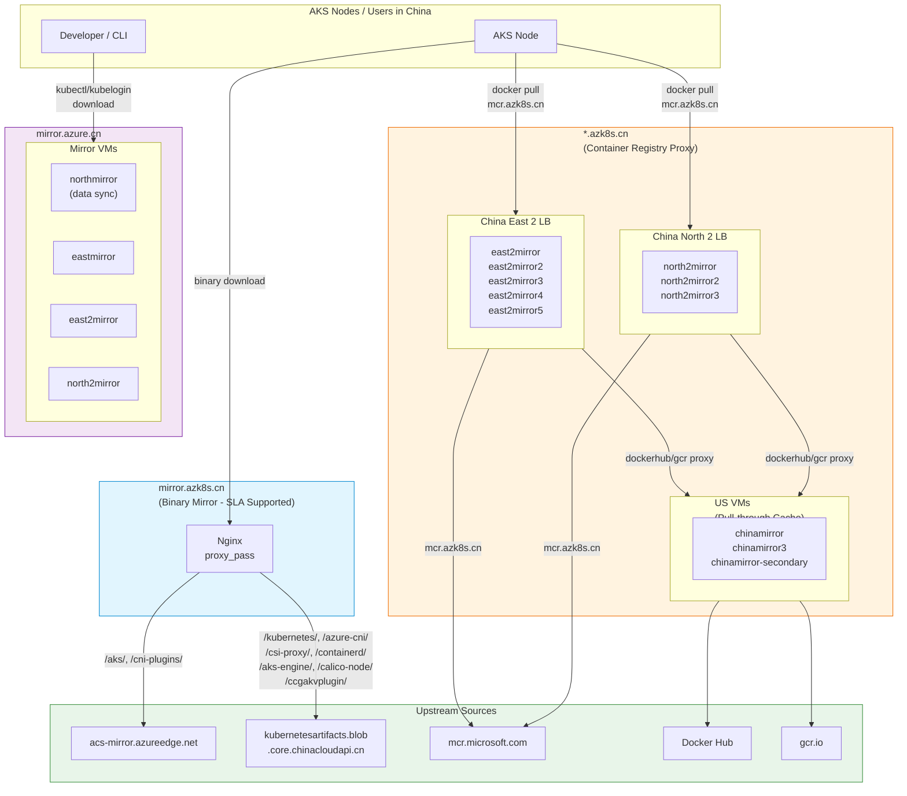

# AKS China Mirror Infrastructure

This document describes the mirror infrastructure serving AKS artifacts and container images in Azure China regions.

## Overview

There are three mirror services:

| Service | Domain | Purpose | SLA Support |
|---------|--------|---------|-------------|
| **Binary Mirror** | `mirror.azk8s.cn` | Nginx reverse proxy for AKS binaries (kubelet, CNI plugins, containerd, etc.) | ✅ Yes |
| **Container Registry Proxy** | `mcr.azk8s.cn` | Docker pull-through cache for MCR images | ✅ Yes (MCR only) |
| **Open Source Package Mirror** | `mirror.azure.cn` | Mirror for open-source packages (kubectl, kubelogin, etc.) | ❌ No |

> **Note:** Other container registry proxy sites (`dockerhub.azk8s.cn`, `gcr.azk8s.cn`, etc.) are **NOT** covered by SLA-based support.

## Architecture Diagram



## 1. mirror.azk8s.cn (Binary Mirror)

**SLA Supported** ✅

Nginx reverse proxy that downloads AKS binaries from upstream sources. Used by AKS node bootstrapping in China regions.

### Proxy Routes

| Path | Upstream |
|------|----------|
| `/aks/` | `acs-mirror.azureedge.net/aks/` |
| `/kubernetes/` | `kubernetesartifacts.blob.core.chinacloudapi.cn/kubernetes/` |
| `/azure-cni/` | `kubernetesartifacts.blob.core.chinacloudapi.cn/azure-cni/` |
| `/cni-plugins/` | `acs-mirror.azureedge.net/cni-plugins/` |
| `/csi-proxy/` | `kubernetesartifacts.blob.core.chinacloudapi.cn/csi-proxy/` |
| `/aks-engine/` | `kubernetesartifacts.blob.core.chinacloudapi.cn/aks-engine/` |
| `/containerd/` | `kubernetesartifacts.blob.core.chinacloudapi.cn/containerd/` |
| `/calico-node/` | `kubernetesartifacts.blob.core.chinacloudapi.cn/calico-node/` |
| `/ccgakvplugin/` | `kubernetesartifacts.blob.core.chinacloudapi.cn/ccgakvplugin/` |

> `mcr.azk8s.cn` is also served via nginx `proxy_pass` from the same infrastructure.

## 2. Container Registry Proxy (*.azk8s.cn)

**SLA Supported for `mcr.azk8s.cn` only** ✅

Uses [Docker pull-through cache](https://docs.docker.com/docker-hub/mirror/#run-a-registry-as-a-pull-through-cache) to proxy container images.

### Infrastructure

**Resource Group:** `aks-mirror` (Subscription: `5ee0365c-...`)

| Region | VMs (LB Backend Pool) | Load Balancer |
|--------|----------------------|---------------|
| China East 2 | east2mirror, east2mirror2, east2mirror3, east2mirror4, east2mirror5 | east2mirror LB |
| China North 2 | north2mirror, north2mirror2, north2mirror3 | north2mirror LB |

**US Pull-through Cache VMs** (Subscription: `598e4ab2-...`, RG: `CHINAMIRROR`):
- `chinamirror3`, `chinamirror`, `chinamirror-secondary`

### Traffic Flow

- **`mcr.azk8s.cn`**: China VMs pull directly from `mcr.microsoft.com` in Azure China — does **not** depend on US VMs.
- **`dockerhub.azk8s.cn`, `gcr.azk8s.cn`**: China VMs route through US VMs since Docker Hub and GCR are not directly accessible from Azure China.

### Registry Proxy Container

Each VM runs a Docker registry pull-through cache:
```bash
docker run -d -p 8000:8000 --restart=always --name registry-proxy-mcr \
  -v /opt/certs:/certs \
  -v /opt/docker-registry-proxy-config/config-mcr.yml:/etc/docker/registry/config.yml \
  -v /datadisks/disk2/docker-registry-mcr:/var/lib/registry \
  -e REGISTRY_HTTP_TLS_CERTIFICATE=/certs/azk8s.cn.crt \
  -e REGISTRY_HTTP_TLS_KEY=/certs/azk8s.cn.key \
  andyzhangx/registry:v2.7.0-nottl
```

Nginx config location: `/etc/nginx/conf.d`

## 3. mirror.azure.cn (Package Mirror)

**No SLA Support** ❌

Mirror for open-source packages. Required by [azure-cli](https://github.com/Azure/azure-cli) for `kubectl` and `kubelogin` downloads on Azure China Cloud:
- `https://mirror.azure.cn/kubernetes/kubelogin`
- `https://mirror.azure.cn/kubernetes/kubectl`

### Infrastructure

**Subscription:** `551566cb-...`

| VM | Region | Role |
|----|--------|------|
| northmirror | China North | Data sync (primary) |
| eastmirror | China East | Serving |
| east2mirror | China East 2 | Serving |
| north2mirror | China North 2 | Serving |

## Operations

### Access

**Jumpbox:** `mirror-monitor2` VM (Subscription `551566cb-...`, RG `MIRROR-MONITOR`) — can access all mirror machines.

SSH port for all mirror VMs: **222**

### Common Issue: File/Image Download Failures

1. Identify affected region (China East 2 or China North 2)
2. SSH to the server VMs
3. Restart nginx: `service nginx restart`

### Certificate Renewal

Certificates are stored at `/opt/certs/` on each VM. When renewing:

```bash
# Extract key from PEM
openssl pkey -in <cert-file>.pem -out azk8s.cn.key
cp <cert-file>.pem azk8s.cn.crt

# Verify
openssl x509 -in azk8s.cn.crt -text
```

Deploy to all VMs via `scp -P 222` then reload nginx on each:

**mirror.azk8s.cn VMs:**
- `east2mirror1.chinaeast2.cloudapp.chinacloudapi.cn`
- `east2mirror2.chinaeast2.cloudapp.chinacloudapi.cn`
- `north2mirror1.chinanorth2.cloudapp.chinacloudapi.cn`
- `north2mirror2.chinanorth2.cloudapp.chinacloudapi.cn`

**Container Registry Proxy VMs (east2cr/north2cr series):**
- `east2cr.chinaeast2.cloudapp.chinacloudapi.cn` (×5)
- `north2cr.chinanorth2.cloudapp.chinacloudapi.cn` (×3)

After deploying certs: `service nginx reload` on each VM.
